# ⛏️ Desta Fauzi — GitHub Profile

  

---

### 📦 Crafting Table (Stack)

| Slot | Item |
| :--- | :--- |
| 🟫 **Backend** | `Laravel` · `PHP` · `Golang` · `FastAPI` |
| 🟩 **Frontend** | `Vue.js` · `React.js` |
| 📱 **Mobile** | `Android` · `iOS` |
| 🧠 **AI/ML** | `Machine Learning` · `RAG` · `N8N Automation` |
| ⚙️ **Infra** | `Docker` · `GitLab CI` · `GCP / AWS / Cloudflare` |

 

  
🗺️ <b>Open Crafting Recipe — Capabilities</b> (click to expand)

   

  <!-- Minecraft Crafting Table UI -->
  <table width="100%" border="1" style="border-collapse: collapse; text-align: center; background-color: #1c1c1c; border-color: #333;">
    <tr>
      <td width="26%" height="90" align="center">⛏️ <small><b>Sys Design</b> (Diamond Pickaxe)</small></td>
      <td width="26%" height="90" align="center">🔩 <small><b>Full-Stack</b> (Iron Ingot)</small></td>
      <td width="26%" height="90" align="center">📱 <small><b>Mobile</b> (Gold Ingot)</small></td>
      <td rowspan="3" width="8%" align="center" style="font-size: 32px; background-color: #161616; border-color: #333;">➡️</td>
      <td rowspan="3" width="14%" align="center" style="background-color: #242b35; border: 2px solid #52baff;">
        🧑‍💻 <b>System Analyst</b> <small style="color: #a9ff1c;"><i>(spawned!)</i></small>
      </td>
    </tr>
    <tr>
      <td width="26%" height="90" align="center">🔴 <small><b>Applied ML</b> (Redstone)</small></td>
      <td width="26%" height="90" align="center">🔮 <small><b>Infra</b> (Ender Pearl)</small></td>
      <td width="26%" height="90" align="center">🛡️ <small><b>Cybersec</b> (Shield)</small></td>
    </tr>
    <tr>
      <td width="26%" height="90" align="center">🧠 <small><b>AI / RAG</b> (Enchanted Book)</small></td>
      <td width="26%" height="90" align="center">⚡ <small><b>Automation</b> (Redstone Torch)</small></td>
      <td width="26%" height="90" align="center">🗄️ <small><b>Database</b> (Obsidian)</small></td>
    </tr>
  </table>

   
  
  - 🛠️ **System design first** — plan the build before placing the first block.
  - 📦 **Full-stack delivery** — mine, craft, and place: DB to API to UI.
  - 🧠 **Applied ML** — no leaked answers hidden in the preprocessing chest.
  - ☁️ **Infra-aware** — owns the server, not just what runs on it.

  
🎮 <b>Achievement Unlocked</b> (click to expand)

   
  
  - 🏆 **"Getting an Upgrade"** — D4 Cybersecurity Engineering
  - 🏆 **"Diamonds!"** — System Analyst, enterprise-scale delivery
  - 🏆 **"We Need to Go Deeper"** — Building AI/ML pipelines end-to-end

---

### 📊 Stats & Discoveries

  
  

<!-- Pac-Man Contribution Graph Animation -->

  <picture>
    <source media="(prefers-color-scheme: dark)" srcset="https://raw.githubusercontent.com/DestaFauzi/DestaFauzi/output/pacman-contribution-graph-dark.svg">
    <source media="(prefers-color-scheme: light)" srcset="https://raw.githubusercontent.com/DestaFauzi/DestaFauzi/output/pacman-contribution-graph.svg">
    
  </picture>

---

### 🌐 Multiplayer Server (Connect)

💬 *Feel free to connect or invite me to your server/project!*

* **IP / LinkedIn:** 
* **Email:** 

 

  <b><code>[ Not chasing green squares. Only chasing diamonds. ]</code></b>

